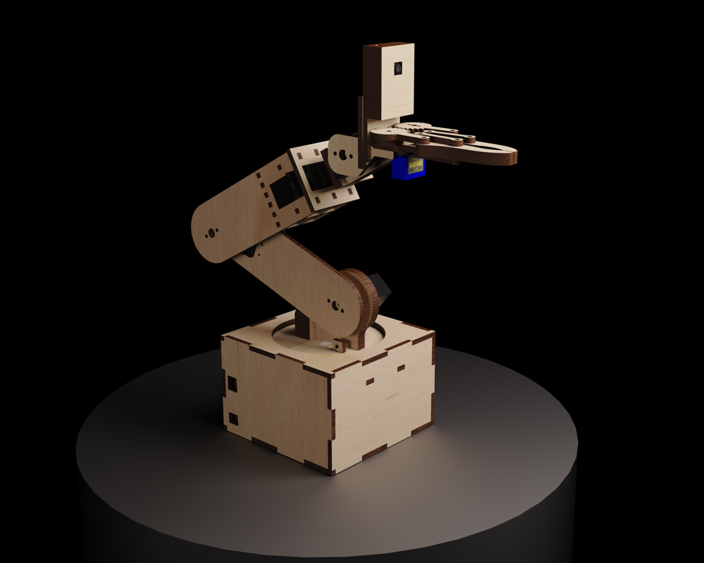
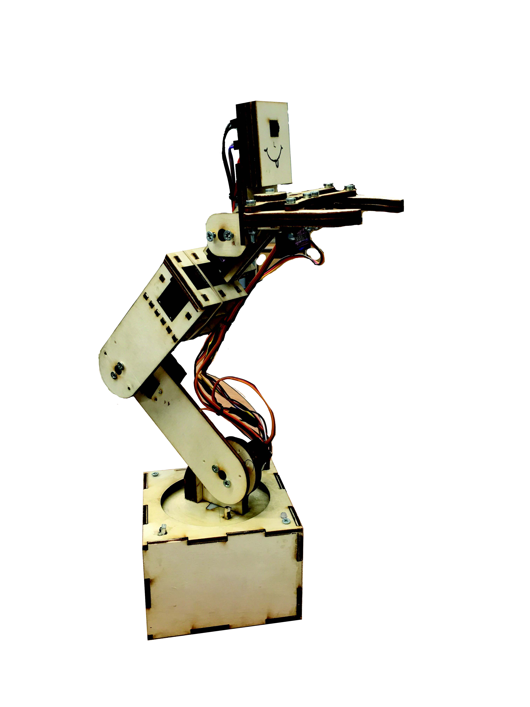
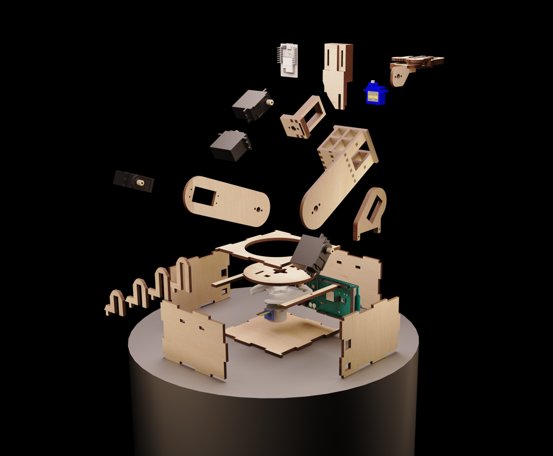
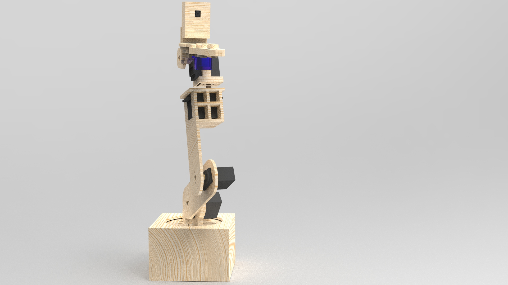
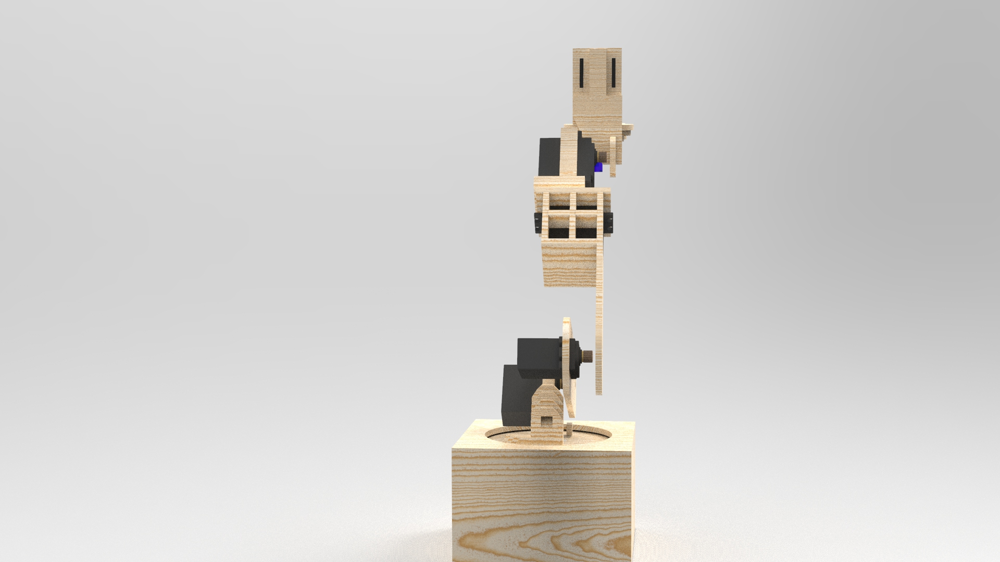
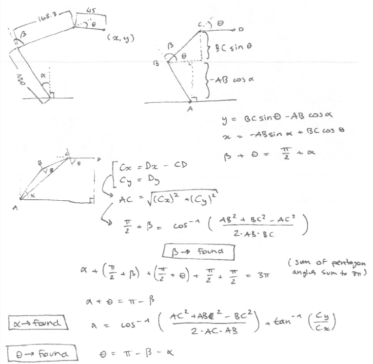
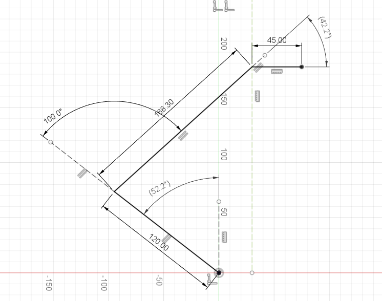
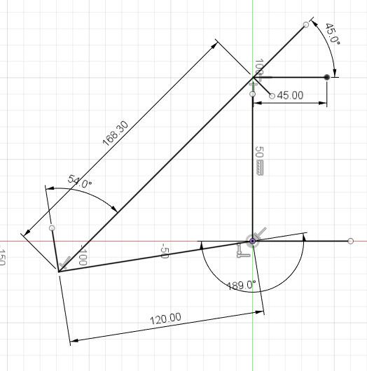
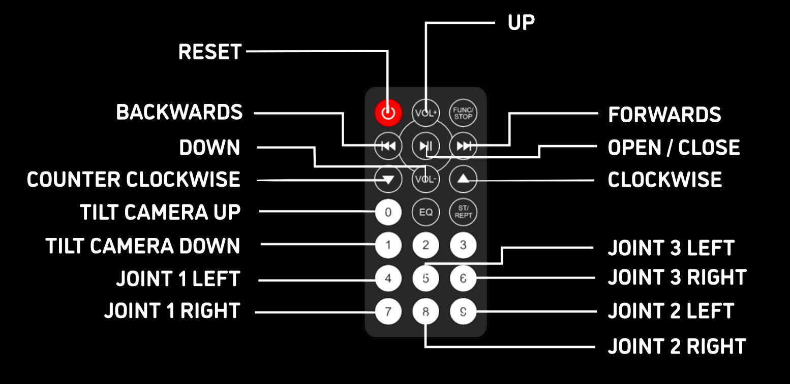
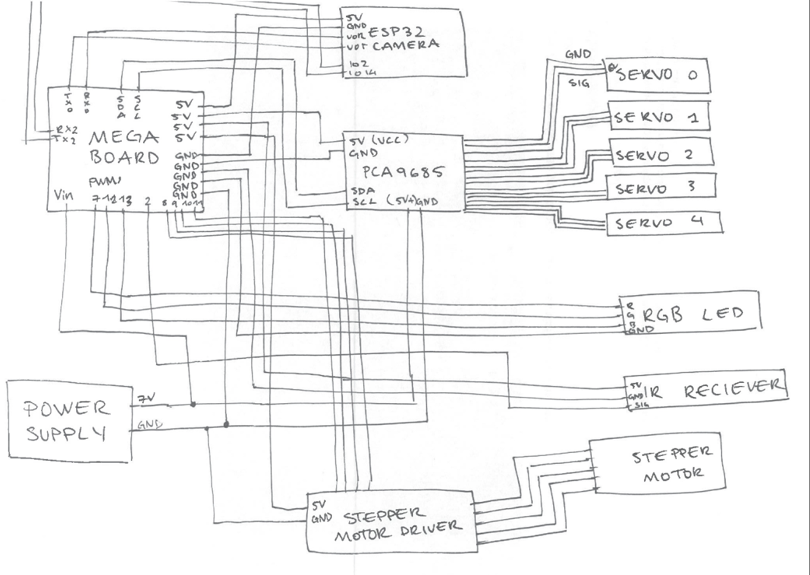

# Brief
 
This project -- *Ode to Plywood* -- reflects the work of the GIZMO (physical computing) module at Imperial College London Design Engineering. The brief required us to create **human interaction with a 'robot'** using plywood. I decided to create a robotic arm and for the interaction, make it detect and track faces. The arm could also extensively be controlled by an infrared remote. 

Youtube video: https://youtu.be/CfiG-eKf2Ww

Below I will go over the process I went over for this project. The code uploaded to the board and camera is included in the "code" directory.

## Construction of Arm

### Inspiration

Before building the arm, I got inspiration from the numerous 3d printed arms available online. I drew most of my design from [this](https://howtomechatronics.com/tutorials/arduino/diy-arduino-robot-arm-with-smartphone-control/) project involving the arm control through a smartphone. 

### Prototyping and CAD

Before cutting the plywood sheets I needed to understand how to transform the 3d printed cad into an arm made of plywood. For this, prototyping with cardboard helped mainly with understanding how to hold the servomotors. 

At first, using the cardboard, I realised that multiple layers were required to maintain the structural integrety of the arm. This was not the case with plywood and I eneded up with excess pieces after laser cutting. Once the prototype was finished, CAD was required to display the arm professionally and to know what parts were required for lasercutting.








### Final Model

After laser cutting, various changes needed to be made due to the differences in material properties between card and plywood. 

- Addition of base stabalizer to maintain a right angle at the base
- Addition of counterweight for the base (when the arm is extended)
- Removal of certain layers of plywood due to its superior strength as well as power of servo motors

### Coding - Inverse Kinematics

The movement of the arm required intense inverse kinematics. I wanted to give the arm certain x,y coordinates and then determine the angles (PWM frequencies) were required for each servo motor. These angles would ensure that the camera/claw remains parallel to the ground. The maths involved surpassed my level so I had to delegate that task to someone else. This is what they came up with:



Validation below using CAD software to vary the angles easily: 



Implementation of code below:
```cpp
double beta = acos((42724.89 - x * x - y * y) / 40392) * (180.0 / 3.14159) - 90.0;
double alpha = (acos((x * x + y * y - 13924.89) / (240 * sqrt(x * x + y * y))) + atan(y / x)) * (180.0 / 3.14159);
double theta = 90 - beta - alpha;

alpha = -alpha + 90;
theta = -theta;
beta = -beta;
```

Additional issues arose with the limits of the stepper motor controling the rotation around the y axis (vector normal to the ground plane) as it had limited torque. It wasn't able to overcome the friction in between the rotating plate and the base if the arm was extended horizontally.

### IR Remote

The remote allowed complete control over the arm's movement. First through the inverse kinematics, second controlling each motor individually. 

The controls are as follows:


The UP/DOWN/FORWARDS/BACKWARDS control, use inverse kinematics to move the claw about the x,y plane in adjustable increments. 

## Face Tracking Camera

### Inspiration

I looked at various arduino projects intergrating the ESP32 Camera, using the facial detection feature. Due to its cheap price (~10$) I chose that particular model of camera. 

### Construction

The arm had been completely built before the integration of the camera. All that was needed was to have a casing for the esp32 camera module, attached to the claw part of the arm (so that it would remain level) with access to the reset button.

### Code

The code itself is pretty straightforwards if the webserver hosted by the camera works. An issue that I came across was the fact that the most recent library (as of 15/12/21) for the esp32 board does not include facial detection for some reason, I had to use version 1.04.

Within the camera's code, sending information via the io2 and io14 pins was copied from [robotzero1's](https://github.com/robotzero1/face-follow-robot) code and was easily modifiable. Although hosting the webserver was more complicated so the default esp32 camera's library's code was used for it.

The pan and the tilt functions only influenced the stepper motors base rotation and the claw's tilt.

## Circuit



### Power

After this project, I will remain wary of overloading my components with too much voltage (as I already have). I actually shorted my megaboard as well as the PCA9685 driver by supplying 30V instead of 6V through a simple mis-click on the power supply.

Anyhow, the PCA9685 driver allows a separate (+) and (-) port for the servo motors (different to powering the actual pca9685) which was beneficial as all of by components ran on 5V instead of 7V for the servos. Instead of calculating the internal resisance of each component to make a proper voltage divider, I supplied the board (through Vin) and the servos with 7V 2A with a variable power supply and supplied each other component with 5V through the board's 5V pins. 

